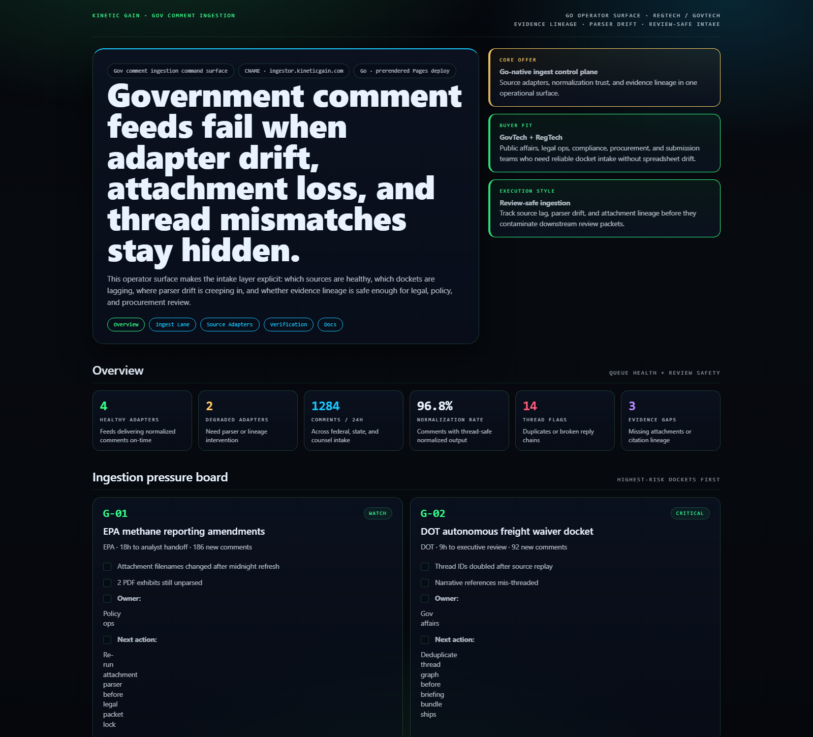
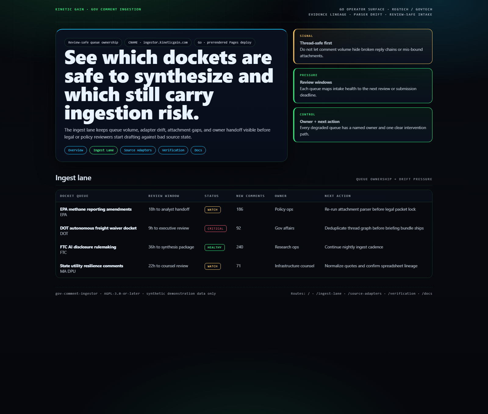
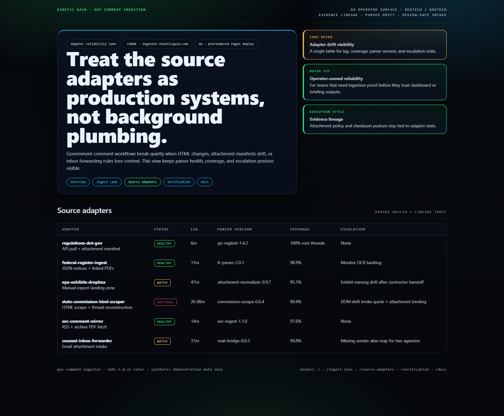
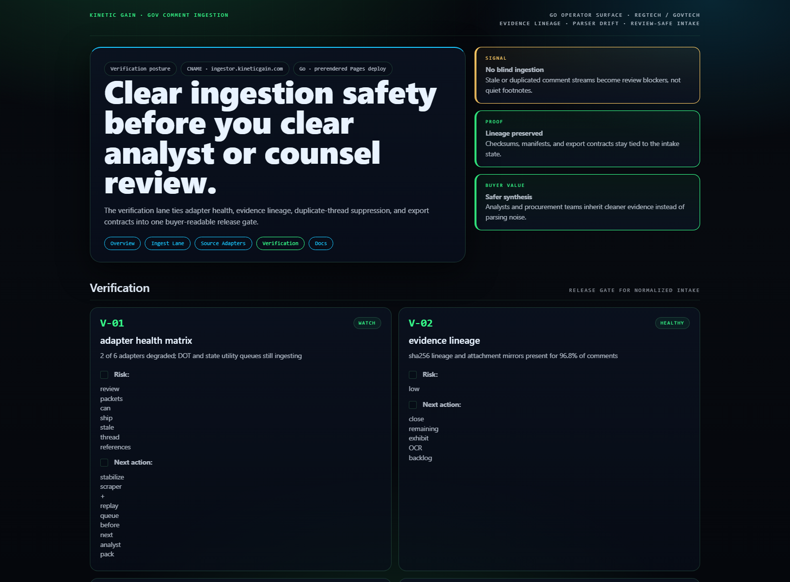

# Gov Comment Ingestor

[](https://github.com/mizcausevic-dev/gov-comment-ingestor/actions/workflows/ci.yml)
[](./LICENSE)
[](https://github.com/mizcausevic-dev/gov-comment-ingestor/actions/workflows/pages.yml)

Go ingestion control plane for government comment feeds, adapter drift, evidence lineage, and review-safe normalization across regulated docket workflows.

## Why this exists

- Regulated comment teams lose time when Federal Register pulls, regulations portal exports, agency PDFs, and manual inbox uploads are tracked in separate tools.
- Legal, policy, and operations reviewers need to know whether a missing submission is caused by source lag, parser drift, duplicate threading, or evidence normalization failure.
- Buyer teams care whether the intake layer preserves traceability before analysts draft a position, not after submission windows close.
- GovTech and RegTech operators need a surface that makes source reliability, docket freshness, and ingestion lineage visible in one place.

## Why this matters (KG Embedded tie-back)

This repo demonstrates the comment-ingestion primitive for GovTech / RegTech buyers: source adapters, parser drift, and evidence lineage tied into one operator surface. A B2B SaaS buyer would care because regulated content often needs to enter customer-facing workflows without unsafe write paths, opaque normalization, or broken audit context. Kinetic Gain Embedded extends this into security-first in-product analytics for submission, review, and governance workflows, see [kineticgain.com/embedded](https://kineticgain.com/embedded).

## Routes

- `/`
- `/ingest-lane`
- `/source-adapters`
- `/verification`
- `/docs`

## API

- `/api/dashboard/summary`
- `/api/ingest-lane`
- `/api/source-adapters`
- `/api/verification`
- `/api/sample`

## Screenshots






## Local development

```powershell
cd gov-comment-ingestor
go run ./cmd/server
```

Open:
- [http://127.0.0.1:5514/](http://127.0.0.1:5514/)
- [http://127.0.0.1:5514/ingest-lane](http://127.0.0.1:5514/ingest-lane)
- [http://127.0.0.1:5514/source-adapters](http://127.0.0.1:5514/source-adapters)
- [http://127.0.0.1:5514/verification](http://127.0.0.1:5514/verification)

## Validation

- `go test ./...`
- `go vet ./...`
- `go run ./cmd/prerender`
- `go run ./cmd/demo`
- `go run ./cmd/smoke`
- `powershell -ExecutionPolicy Bypass -File .\scripts\render_readme_assets.ps1`

## Production status

| Aspect | Status |
|--------|--------|
| CI | Go 1.26 — fmt check · test · vet · prerender · demo · smoke ([workflow](./.github/workflows/ci.yml)) |
| Test coverage | Example service coverage with release gate expansion path |
| License | [AGPL-3.0-or-later](./LICENSE) |
| Security | [SECURITY.md](./SECURITY.md) |
| Deploy | Static prerender → **https://ingestor.kineticgain.com/** (GitHub Pages, [pages workflow](./.github/workflows/pages.yml)) |

## Docs

- [Architecture](./docs/architecture.md)
- [Origin](./docs/ORIGIN.md)
- [Kinetic Gain Embedded tie-back](./docs/KINETIC_GAIN_EMBEDDED.md)
- [Changelog](./CHANGELOG.md)

